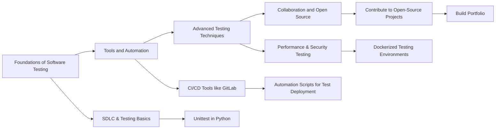

+++
title = "Could I be a Test Engineer?"
description = "Part 1: of a series on getting AI insights on my career path."
date = 2024-12-08

[extra]
banner = "test-engineer.webp"
hot = true
draft = true
disclaimer="""
This article demonstrates how to use AI Always use AI responsibly. Be aware of hallucination. Always fact-check outputs. 
"""

[taxonomies]
tags = ["Career", "Roadmap"]
+++

# Could I be a Test Engineer?

## Introduction

**This post is first of a planned series that explores the idea of leveraging AI to "try on" different careers.**

Like many professionals, I’ve accumulated a broad and eclectic skillset but found myself wondering how to bridge gaps when exploring new opportunities. Using AI as a career co-pilot, I’ll share roadmaps tailored to roles I find fascinating, beginning with this post.

Here’s how I’m using AI:

1. Assess my compatibility with a role posted on LinkedIn.
2. Create a roadmap of skills to bridge gaps in my knowledge.
3. Generate a mermaid flowchart that visualises the roadmap.
4. Tailor my resume and cover letter for the role (optional).

 

---

## My Background  

I’ve always been passionate about technology. I got my first computer at 12. Its performance was shocking... Probably 10 years old when I got it. It barely ran XP, but I was determined to squeeze every last bit of juice out of it. My Dad had heard something about Linux in his sysadmin days and gave me a thick copy of a RedHat manual that was probably 10 years older than the computer. I read that thing late into the night and felt like I'd discovered a whole new world of computing. 

Before long I was running Ubuntu *Jaunty Jackalope* full time.
My Dad was actually pretty proud of me. Proud enough he mentioned it in his speech at my wedding.

Computers aside, I grew interested in photography, then videography, then film. I pursued film in high school and university, but the job market in my part of the world was oversaturated and underpaid. Instead, of Hollywood, I found myself working at a startup specialising in [virtual tours](https://uq.youtour.com.au/). Unlike editing feature films, these virtual tours only ever went together in the intended order. I quickly discovered how automation could streamline the repetition. My automations became more advanced and I picked up AutoHotkey 🎹, Javascript ☕️ and Python 🐍 on the way. 

This spark led me to software development and later IT administration at a high school, managing Apple and Windows endpoints using Jamf, Intune, and SCCM. 

At time of writing, this is where I remain.

Now, with a growing family, I’m on the hunt for a remote-friendly role that offers better work-life balance and financial stability. While my eclectic background has rounded out my skills and made me a better problem-solver, it’s also left me with gaps that complicate job applications. 

So, I had this idea: what if I asked AI to help me bridge those gaps? 

That’s where this blog series comes in — to map out actionable steps for career transitions.

---

## Test Engineer: An Overview

Test Engineers ensure the quality and functionality of software through systematic testing processes. They create and execute test plans, identify bugs, and collaborate with developers to improve software reliability. This role is ideal for detail-oriented individuals who enjoy problem-solving and optimizing systems.

---

## Roadmap to Becoming a Test Engineer

### Phase 1: Foundations of Software Testing

**What to Learn:**
- Unit tests, integration tests, and regression tests: what they are and why they matter.
- The Software Development Lifecycle (SDLC) and the role of testing.
- Python’s `unittest` module to write basic tests.

**What to Do:**
- Write unit tests for a small Python project.
- Practice Test-Driven Development (TDD) with simple scripts.

### Phase 2: Tools and Automation

**What to Learn:**
- Testing frameworks like `pytest` and `nose2`.
- CI/CD tools (e.g., GitLab CI/CD) for automated testing.
- Writing shell scripts to integrate automated tests into workflows.

**What to Do:**
- Set up a GitLab repository with a CI/CD pipeline that runs tests.
- Automate repetitive tasks like test deployments using scripts.

### Phase 3: Advanced Testing Techniques

**What to Learn:**
- Shift-left testing: catching bugs early in the pipeline.
- Basics of performance and security testing.
- Setting up Dockerized testing environments.

**What to Do:**
- Use Python tools like `responses` to mock APIs in integration tests.
- Test a Python web app’s performance with tools like Selenium or Locust.

### Phase 4: Collaboration and Open Source

**What to Learn:**
- Documentation practices in collaborative testing environments.
- Quality assurance strategies in large projects.

**What to Do:**
- Contribute to an open-source project by writing or improving test cases.
- Build a portfolio showcasing your contributions and testing expertise.

---

## Visualizing the Plan

Here’s a roadmap of the above plan:

---

## Final Thoughts

Embarking on a career transition can feel overwhelming, but breaking the journey into phases makes it manageable. By focusing on foundational knowledge, hands-on practice, and collaboration, anyone—including me—can work toward becoming a Test Engineer.

If you’ve walked this path or have resources to share, I’d love to hear your insights in the comments. Stay tuned for the next post in this series, where I’ll tackle another role with the help of AI!

---


LLMs can provide useful insights but are not foolproof. Validate the output before acting on it.


