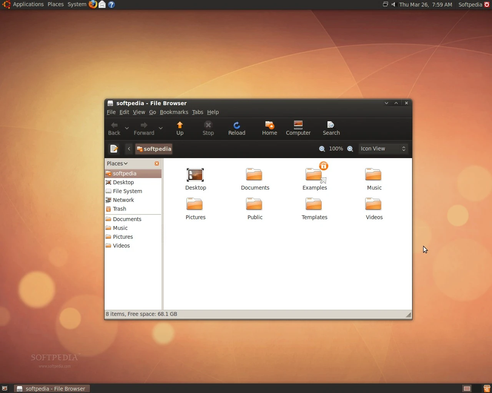

# Hi! 👋 My name's Caleb. 

**Welcome to my little corner of Cyberspace 💫**

This is where I blog about my various projects, tinkerings and thoughts in technology – and some other stuff too!

In short, the musings of a **Battle Hardened Tech Noob 🤓💥**

---

## Why am I blogging?

My hope is that it will allow me to [learn better](https://fs.blog/feynman-technique/), teach better and find like-minded lads and lassies to collaborate with.

If I learn it and I like it, I'll try to write about it here.

## Who am I?

I'm Caleb Trevatt.

- I was born in [Brisbane, Queensland, Australia 🐨](https://duckduckgo.com/?q=brisbane+queensland+australia&t=vivaldi&atb=v389-1&iaxm=directions&end=Brisbane&transport=walking).
- I grew up in [Bali, Indonesia 🇮🇩](https://duckduckgo.com/?q=bali&t=vivaldi&atb=v389-1&iaxm=directions&end=Bali&transport=walking).
- I'm now based back [Down Under 🦘](https://duckduckgo.com/?q=brisbane+queensland+australia&t=vivaldi&atb=v389-1&iaxm=directions&end=Brisbane&transport=walking).

I'm a son, husband and father. ✝👨‍👨‍👦

I'm also a [Software Developer](https://github.com/in03) 💾, [Cybersecurity Student](https://www.vu.edu.au/courses/certificate-iv-in-cyber-security-22603vic) 🔐, [Video Veteran](https://vimeo.com/trevattpictures) 📽, [Musician](https://soundcloud.com/in03) 🎶 and [Writer](/archives) ✍  

### By Day 🌅

I work as a **Desktop Systems Engineer**. I manage endpoint configuration and software deployments for the education sector.
As part of a close-knit team, I also trade hats in technical support (walk-ins, onsite and remote)

When there's time, I like to develop automation workflows to make life easier.

My tools of the trade include Proxmox, Python, PowerShell, Intune, Linux, Docker, LXCs, VMs, ZFS and the like.

### By Night 🌙

As a time poor Dad, I've had little to show for my free time over the last few years...
Recently, I've found inspiration to work on stuff again ✨

**Stuff like...**

👐 Open-source

- I'm passionate about open-source ❤
- I've contributed to several open source projects including [Mycroft](https://github.com/MycroftAI/mycroft-core), [Mods](https://github.com/charmbracelet/mods), [Cursor](https://cursor.sh), [PyDavinci](https://github.com/pedrolabonia/pydavinci)
- I also maintain some projects [myself](https://github.com/in03)!

{}

 I built Proxima to do distributed proxy transcoding across multiple machines 

---

🐧 Linux

- I've been a Linux enthusiast since 2009
- I first installed *[Ubuntu Jaunty Jackalope](https://lists.ubuntu.com/archives/ubuntu-devel-announce/2008-September/000481.html)* inspired by my Dad's 90's guide to RedHat Linux.
- I mainly did it to squeeze out more performance from my *Compaq Potato* first computer.

🐍 Software Dev

- Long-time [Python](https://www.python.org) programmer
- Enjoy PowerShell more than I was expecting to 😬
- Know enough Javascript and webdev to be dangerous 🚧
- Going headstrong into [Go](https://go.dev) is probably a good next step
- Keen to get more into functional programming ([Elixir](https://elixir-lang.org), [Gleam](https://gleam.run))
- Have a healthy fear of [Rust](https://www.rust-lang.org) 🦀
- Long-time [Changelog](https://changelog.com/podcast) listener 🎙

<iframe frameBorder="0" height="157px" width="690px" src="https://git-graph.vercel.app/embed/in03?showColorLegend=true&showWeekdayLabels=true&showMonthLabels=true&showTotalCount=true&blockMargin=2&blockRadius=2&blockSize=10&fontSize=14&weekStart=4&year=2024"></iframe>

Stats are looking a bit sad now that I don't use GitHub for work...

☁ Self-hosting

- I'm a long-time homelabber!
- I started with a Raspberry Pi 4 2GB
- Use Proxmox, Ubuntu, DietPi, TrueNAS, Ansible, on:
  - `Ryzen 5 5500 + 24TiB ZFS ZRAID2 + ancient (literally rusty) GTX 680`
  - `Raspberry Pi 4GB + MergerFS + Crucial MX500 SSDs`
- Docker, LXC, VMs 🏗
- I ♥ Cloudflare & Tailscale.

📡 Decentralised Comms

- [LoRa is awesome](https://en.wikipedia.org/wiki/LoRa)! I have some cheeky TTGO T-Beam LoRa capable radios
- I enjoy hacking on mesh-networking with [Meshtastic](https://meshtastic.org)
- A fellow mesher and I established a 24KM LOS link between two nodes!

⚡ Workflow automation

- I love working on tooling to automate workflows.
- My love for automation started with [AutoHotkey](https://www.autohotkey.com)
- Especially robust, long runnin-tasks
- Performant distributed computing makes me happy (when it works) ⚡

🤖 AI

- I am fascinated by AI 👀
- I'm excited by the prospects of automation flexibility using AI
- WIth my background in film, I love the development of generative AI in creative arts!
- I've enoyed implementing cutting-edge AI solutions with LangChain, Flowise and GPTScript.

**See more details on my projects [here](/projects)!**

## Who are you?

I'm always on the look out for opportunities to collaborate with like-minded individuals on cool projects! ✨️
If you're interested, hit me up on on one of my socials or add a comment here!
